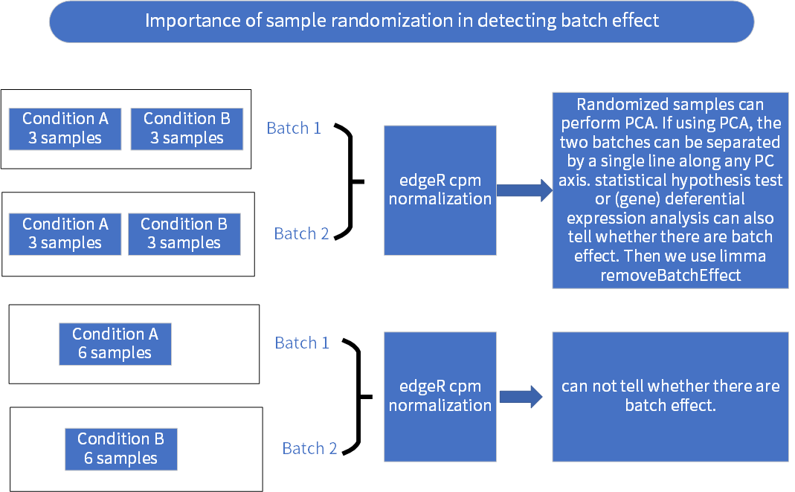

# initial settings

```{r warning=F, message=F}
rm(list = ls())
ptm <- proc.time()
# proc.time() - ptm
options(stringsAsFactors = F)
library("magrittr")
library("readxl")
library("edgeR")
library("limma")
# library("gplots")
```

# Understand batch effect




# Set up input and output files and directories.

```{r}
grouping_path <- file.path("..", "01_cloud_workflow", "metadata", "samples_cell_lines_batch_both_SampleGroup.xlsx")
expression_path <- file.path(".", "intermediate_files", "htseq_count_expression_matrix.csv.bz2")

output_directory <- file.path(".", "intermediate_files")
```

# Read the files from hard disk.

```{r}
raw_expression_dataframe <- read.csv(expression_path, row.names = 1, check.names = F)
grouping_dataframe <- read_excel(grouping_path)
```

# Normalization using cpm funcion in edgeR package

```{r}
normalized_expression_matrix <- cpm(raw_expression_dataframe, log = T)
```

# Remove batch effect using removeBatchEffect function in limma package

```{r}
batch_effect_removed_normalized_expression_matrix <-
    removeBatchEffect(normalized_expression_matrix, batch = grouping_dataframe$Batch)
```

# Remove weird genes such as pseudogenes and unconfirmed genes.

```{r}
all_genes <- rownames(batch_effect_removed_normalized_expression_matrix)

remaining_genes <- grep("^[A-Z][A-Z1-9]+[.][1-9]+", all_genes, perl=TRUE, value=TRUE, invert=TRUE)
remaining_genes <- grep("\\.", remaining_genes, perl=TRUE, value=TRUE, invert=TRUE)
remaining_genes <- grep("^MT-*[A-Z1-9]+", remaining_genes, perl=TRUE, value=TRUE, invert=TRUE)
remaining_genes <- grep("hsa-mir", remaining_genes, perl=TRUE, value=TRUE, invert=TRUE)
remaining_genes <- grep("^MIR\\d+", remaining_genes, perl=TRUE, value=TRUE, invert=TRUE)
remaining_genes <- grep("^RNA\\d+[A-Z1-9]+", remaining_genes, perl=TRUE, value=TRUE, invert=TRUE)
remaining_genes <- grep("^RNU\\d+", remaining_genes, perl=TRUE, value=TRUE, invert=TRUE)
remaining_genes <- grep("^RNVU\\d+", remaining_genes, perl=TRUE, value=TRUE, invert=TRUE)
remaining_genes <- grep("^RNY\\d+", remaining_genes, perl=TRUE, value=TRUE, invert=TRUE)
remaining_genes <- grep("^HNRN", remaining_genes, perl=TRUE, value=TRUE, invert=TRUE)
remaining_genes <- grep("^SNOR[A-Z]\\d+[A-Z1-9]*", remaining_genes, perl=TRUE, value=TRUE, invert=TRUE)
remaining_genes <- grep("^LOC\\d+[A-Z1-9]+", remaining_genes, perl=TRUE, value=TRUE, invert=TRUE)
remaining_genes <- grep("^LINC\\d+[A-Z1-9]+", remaining_genes, perl=TRUE, value=TRUE, invert=TRUE)
remaining_genes <- grep("^SCARNA\\d+[A-Z1-9]*", remaining_genes, perl=TRUE, value=TRUE, invert=TRUE)
remaining_genes <- grep("[A-Z1-9]+-[A-Z1-9][A-Z1-9]+", remaining_genes, perl=TRUE, value=TRUE, invert=TRUE)

## remove genes that are pseudo genes/unconfirmed
corrected_expression_dataframe <- batch_effect_removed_normalized_expression_matrix %>%
    .[remaining_genes, , drop = F] %>%
    as.data.frame
```

# Identify genes with high variability

compute IQR, max value

```{r}
temporary_expression_dataframe <- corrected_expression_dataframe

temporary_expression_dataframe$IQR <- apply(corrected_expression_dataframe, 1, IQR)
temporary_expression_dataframe$max <- apply(corrected_expression_dataframe, 1, max)

#sort by IQR
temporary_expression_dataframe <- temporary_expression_dataframe %>%
    .[order(.$IQR, decreasing=T), ]

## remove gene with log2 CPM < 0, and also choose those with IQR >= 1
temporary_expression_dataframe <- temporary_expression_dataframe[temporary_expression_dataframe$max >= 0, ]
temporary_expression_dataframe <- temporary_expression_dataframe[temporary_expression_dataframe$IQR >= 1, ]

temporary_expression_dataframe$max <- NULL
temporary_expression_dataframe$IQR <-  NULL

# Remove the outlier
temporary_expression_dataframe[, "M238-CTRL-1hr"] <- NULL

##remove IQR and max column, choose the top 5000 genes based on IQR
temporary_expression_dataframe_top_5000 <- temporary_expression_dataframe[1:5000, ]
```

# PCA computation

```{r}
## the PCA computation, use scaling
pca.res<-prcomp(t(temporary_expression_dataframe_top_5000),scale.=T,retx=T)
pc.var<-pca.res$sdev^2

#percentage of variance explained 
pc.per<-round(pc.var/sum(pc.var)*100, 1)
x<-as.data.frame(pca.res$x)

plot.default(x$PC1,x$PC2,type="p",pch=c(21),
             bg="red",
             col="white",
             lwd=2,cex=2.5,xaxs="r",yaxs="r",bty="l",
             cex.axis=1,cex.main=1,cex.lab=1,font.lab=2,font.axis=2)
```


```{r}
proc.time() - ptm
```

