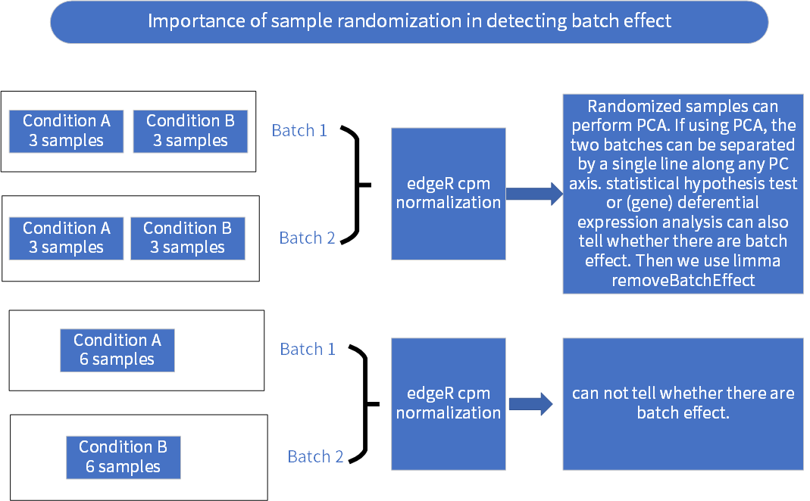

# Initial environment settings

```{r warning=F, message=F}
rm(list = ls())
ptm <- proc.time()
# proc.time() - ptm
options(stringsAsFactors = F)
library("magrittr")
library("readxl")
library("ggplot2")
library("ggpubr")
library("ggfortify")
library("tibble")
library("ggrepel")
library("hash")
library("rgl")
```

# Understand batch effect



# Set up input and output files and directories.

```{r}
grouping_path <- file.path("..", "01_cloud_workflow", "metadata", "samples_cell_lines_batch_both_SampleGroup.xlsx")

raw_count_path <- file.path(".", "intermediate_files", "expr_mat.raw_count.csv.bz2")
log2_cpm_path <- file.path(".", "intermediate_files", "expr_mat.log2_cpm.csv.bz2")
log2_cpm_BE_adj_path <- file.path(".", "intermediate_files", "expr_mat.log2_cpm.BE_adj.csv.bz2")
log2_cpm_BE_adj_filtered_path <- file.path(".", "intermediate_files", "expr_mat.log2_cpm.BE_adj.filtered.csv.bz2")

box_plot_output_directory <- file.path(".", "intermediate_files", "batch_effect_box_plots") %T>%
    dir.create(., showWarnings = F, recursive = T)

pca_plot_output_directory <- file.path(".", "intermediate_files", "batch_effect_pca_plots") %T>%
    dir.create(., showWarnings = F, recursive = T)
```

# Combine the possible conditions that will be plotted.

```{r}
manipulation_genres <- c("raw_count", "log2_cpm", "log2_cpm.BE_adj", "log2_cpm.BE_adj.filtered")
label_genres <- c("labelled", "unlabelled")
manipulation_label_grid_dataframe <- expand.grid(manipulation = manipulation_genres, label = label_genres)
manipulation_label_grid_dataframe
```

# Read the files from hard disk.

```{r}
expression_dataframe_list <- c(raw_count_path, log2_cpm_path, log2_cpm_BE_adj_path, log2_cpm_BE_adj_filtered_path) %>%
    setNames(., manipulation_genres) %>%
    lapply(., read.csv, row.names = 1, check.names = F)

grouping_dataframe <- read_excel(grouping_path)
grouping_hash <- hash::hash(keys = grouping_dataframe$File, values = grouping_dataframe$Batch)
```

# Calculate the statistical values for samples for different gene expression matrices.

Get the long dataframes to draw box plots.

```{r}
get_long_dataframe <- function(an_expression_dataframe, factor_dataframe, statistical_function) {
    
    # an_expression_dataframe<- raw_expression_dataframe
    # factor_dataframe <- grouping_dataframe
    # statistical_function <- sum
    batch_1_column_names <- factor_dataframe %$%
        subset(., Batch == 1) %>%
        use_series(., File)
    batch_2_column_names <- factor_dataframe %$%
        subset(., Batch == 2) %>%
        use_series(., File)

    batch_1_dataframe <- an_expression_dataframe %$%
        .[, colnames(.) %in% batch_1_column_names]
    batch_2_dataframe <- an_expression_dataframe %$%
        .[, colnames(.) %in% batch_2_column_names]

    batch_1_read_statistics <- apply(batch_1_dataframe, 2, statistical_function)
    batch_2_read_statistics <- apply(batch_2_dataframe, 2, statistical_function)

    # Probably not all normal distribution.
    shapiro.test(batch_1_read_statistics)
    shapiro.test(batch_2_read_statistics)

    # Some statistics test.
    var.test(batch_1_read_statistics, batch_2_read_statistics)
    wilcox.test(batch_1_read_statistics, batch_2_read_statistics)
    
    # make a long dataframe to apply ggplot2 graphics
    dataframe_to_plot <- data.frame(
        statistic_value = c(batch_1_read_statistics, batch_2_read_statistics),
        batch_group = c(rep("batch_1", times = length(batch_1_read_statistics)),
                        rep("batch_2", times = length(batch_2_read_statistics)))
    )
}

# Convert each expression matrx to long dataframe with different statistic values calculated.
raw_count_long_dataframe <-
    get_long_dataframe(expression_dataframe_list[["raw_count"]], grouping_dataframe, sum)

log2_cpm_long_dataframe <-
    get_long_dataframe(expression_dataframe_list[["log2_cpm"]], grouping_dataframe, median)

log2_cpm_BE_adj_long_dataframe <-
    get_long_dataframe(expression_dataframe_list[["log2_cpm.BE_adj"]], grouping_dataframe, median)

log2_cpm_BE_adj_filtered_long_dataframe <-
    get_long_dataframe(expression_dataframe_list[["log2_cpm.BE_adj.filtered"]], grouping_dataframe, median)
```

# Plot jitter box plots to see the batch affect.

```{r}
plot_dataframe_list <- list(raw_count.colsums = raw_count_long_dataframe,
                            log2_cpm.medians = log2_cpm_long_dataframe,
                            log2_cpm.BE_adj.medians = log2_cpm_BE_adj_long_dataframe,
                            log2_cpm.BE_adj.filtered.medians = log2_cpm_BE_adj_filtered_long_dataframe)
my_comparisons <- list(c("batch_1", "batch_2"))

for(i in seq_len(nrow(manipulation_label_grid_dataframe))) {
    current_manipulation <- manipulation_label_grid_dataframe[i, "manipulation"]
    current_labelling <- manipulation_label_grid_dataframe[i, "label"]
    current_long_dataframe <- plot_dataframe_list[[current_manipulation]]
    
    my_plot <- ggplot(current_long_dataframe,
                      aes(x = batch_group, y = statistic_value, color = batch_group)) +
        geom_boxplot(outlier.shape = NA) +
        geom_jitter(width = 0.2) +
        stat_compare_means(comparisons = my_comparisons, method = "wilcox.test") +
        ggtitle("Wilcoxon_rank_sum_test") +
        ylab(current_manipulation)
    
    
    if (current_labelling == "unlabelled") {
        final_boxplot <- my_plot
    } else {
        # Add labels to the data points
        final_boxplot <- my_plot +
            geom_text_repel(data = subset(current_long_dataframe, batch_group == "batch_1"),
                            aes(label = rownames(subset(current_long_dataframe, batch_group == "batch_1"))),
                            direction = "y", nudge_x = -0.5,
                            color = "black",
                            size = 2, segment.size = 0.25, segment.alpha = 0.5) +
            geom_text_repel(data = subset(current_long_dataframe, batch_group == "batch_2"),
                            aes(label = rownames(subset(current_long_dataframe, batch_group == "batch_2"))),
                            direction = "y", nudge_x = 0.5,
                            color = "black",
                            size = 2, segment.size = 0.25, segment.alpha = 0.5) +
            theme(legend.position = "none")
    }
    
    ggsave(filename = paste("batch_effect", current_labelling, current_manipulation, "pdf", sep = "."),
           plot = final_boxplot,
           device = "pdf",
           path = box_plot_output_directory,
           width = 170,
           height = 170,
           units = "mm")
    # Sys.sleep(1)
}
final_boxplot
```


# Perform PCA and draw with ggplot2 graphics

https://aaronschlegel.me/principal-component-analysis-r-example.html

https://cran.r-project.org/web/packages/ggfortify/vignettes/plot_pca.html

https://cran.r-project.org/web/packages/ggrepel/vignettes/ggrepel.html#options

sort by IQR, because we are more interested in higher variance genes. choose the top 5000 genes based on IQR.

```{r}
manipulation_label_grid_dataframe
```


```{r}
for(i in seq_len(nrow(manipulation_label_grid_dataframe))) {
    
    current_manipulation <- manipulation_label_grid_dataframe[i, "manipulation"]
    current_labelling <- manipulation_label_grid_dataframe[i, "label"]
    
    # PCA wants transposed gene expression matrix, namely samples x genes.

    transposed_dataframe <- expression_dataframe_list[[current_manipulation]] %>%
        inset(., "IQR", value = apply(., 1, IQR)) %>%
        .[order(.$IQR, decreasing = T), ] %>%
        .[1:5000, ] %>%
        inset(., "IQR", value = NULL) %>%
        t %>%
        as.data.frame

    # Create another first column to act as batch factors for later grouping or labelling.
    labelled_dataframe <- rownames_to_column(transposed_dataframe, var = "Batch") %>%
        inset(., "Batch", value = as.factor(hash::values(grouping_hash, keys = .$Batch))) %>%
        set_rownames(., value = rownames(transposed_dataframe))
    
    # The labelling/grouping column should be excluded in pca, but included in later plotting.
    pca_result <- prcomp(labelled_dataframe[, -1], scale. = T)
    
    if (current_labelling == "unlabelled") {
        pca_plot <- autoplot(pca_result, data = labelled_dataframe, colour = "Batch")
    } else {
        # Add labels to the data points
        pca_plot <- autoplot(pca_result, data = labelled_dataframe, colour = "Batch") +
            geom_text_repel(aes(label = rownames(labelled_dataframe)),
                            size = 2, segment.size = 0.25, segment.alpha = 0.5)
    }
    
    output_graph_name <- paste("batch_effect",
                               "PCA",
                               current_labelling,
                               current_manipulation,
                               "pdf",
                               sep = ".")

    ggsave(filename = output_graph_name,
           plot = pca_plot,
           device = "pdf",
           path = pca_plot_output_directory,
           width = 170,
           height = 170,
           units = "mm")
    # Sys.sleep(1)
}
pca_plot
```

# Last iterated recombination data frame

```{r}
manipulation_label_grid_dataframe[i, ]
```

# Perform PCA and plot using base graphics

```{r}
## the PCA computation, use scaling
pca.res<-prcomp(labelled_dataframe[, -1],scale.=T,retx=T)
pc.var<-pca.res$sdev^2

#percentage of variance explained 
pc.per<-round(pc.var/sum(pc.var)*100, 1)
x<-as.data.frame(pca.res$x)

plot.default(x$PC1,x$PC2,type="p",pch=c(21),
             bg=c("red","black")[labelled_dataframe$Batch],
             col="white",
             lwd=2,cex=2.5,xaxs="r",yaxs="r",bty="l",
             cex.axis=1,cex.main=1,cex.lab=1,font.lab=2,font.axis=2)
```

# Draw 3D PCA using package rgl

```{r eval = FALSE}
plot3d(x$PC1,x$PC2,x$PC3,type="s",col=c("red","black")[labelled_dataframe$Batch],size=2)
grid3d("x")
grid3d("y+")
grid3d("z")
rgl.snapshot(file.path(pca_plot_output_directory, paste("batch_effect", "3D_PCA", "png", sep = ".")))
```

```{r}
proc.time() - ptm
```

